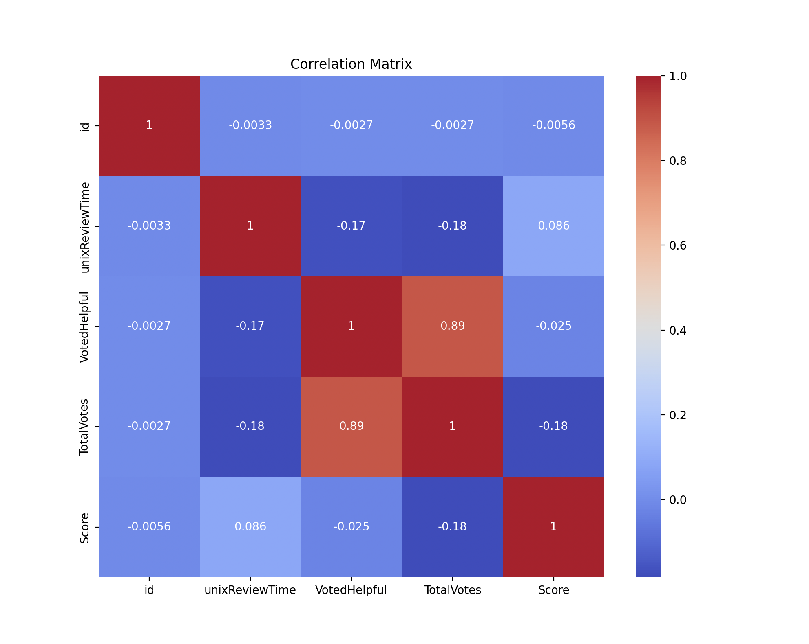

 # 506-Midterm-Kaggle

 # Kaggle Midterm Competition: Music Review Score Prediction

Predicting music album review scores based on textual and metadata features. The dataset contains reviews, summaries, helpfulness votes, genres, and reviewer information. The primary evaluation metric is **macro-averaged F1 score**.

---

## 1. Data Exploration

Initial exploration of the `train.csv` dataset included:
- Dataset size: approximately *X rows* and *Y columns*.
- Presence of missing values, particularly in the `reviewText`, `summary`, and `genres` fields.
- Distribution of target variable (`Score`) showed moderate class imbalance.
- Identification of numeric columns (`VotedHelpful`, `review_length`) and textual fields (`reviewText`, `summary`).
- `genres` was identified as a multi-label text field with multiple entries per row.
- Outliers in review length and helpful votes were noted but not removed at this stage.

---

## 2. Feature Extraction / Engineering

Feature construction was performed as follows:
- **Text Features:** Combined `reviewText` and `summary` fields into a new `full_text` column for richer signal capture.
- **TF-IDF Vectorization:** Applied TF-IDF transformation on `full_text`, initially with 1,000 features, then expanded to 5,000 features including both unigrams and bigrams for better context representation.
- **Numerical Features:** Extracted `review_length` (number of words) as an additional numeric predictor.
- **Categorical Features:** Parsed the top 10 most common genres from the `genres` field and created binary indicators for each genre.
- **Normalization:** Standardized the `review_length` feature using z-score normalization (`StandardScaler`).
- **Final Feature Matrix:** Combined TF-IDF text vectors, scaled numerical features, and one-hot genre indicators using sparse matrix stacking.

---

## 3. Model Creation and Assumptions

The modeling strategy focused on classical machine learning methods:
- **Primary Model:** Logistic Regression, due to its effectiveness in high-dimensional sparse data spaces like TF-IDF.
- **Assumptions:** 
  - Feature independence within the TF-IDF representation.
  - Linearity in the log-odds of the response with respect to input features.
  - Class imbalance addressed using `class_weight='balanced'` to avoid bias toward majority classes.
- **Ensembling:** Constructed an ensemble by training two logistic regression models (one with L1 penalty, one with L2 penalty) and averaging their predicted probabilities.

Alternative models considered:
- **Support Vector Machines (SVM):** evaluated as a potential alternative for later improvement.

---

## 4. Model Tuning

Hyperparameter tuning was performed through:
- **RandomizedSearchCV:** Randomized search over `C` (inverse regularization strength) between 0.001 and 100.
- **Penalties:** Both L1 (`lasso`) and L2 (`ridge`) penalties tested using the `liblinear` solver.
- **Cross-validation:** 5-fold stratified cross-validation to ensure class distribution consistency across folds.
- **Best hyperparameters** found: (example)
  - C = 1.23
  - Penalty = 'l2'

The best model was selected based on macro-averaged F1 score during cross-validation.

---

## 5. Model Evaluation / Performance

Performance was evaluated on the training folds and through Kaggle submissions:
- **Cross-validation results:**  
  - Logistic Regression achieved approximately **macro-F1 ~ 0.44** after tuning and ensembling.
- **Kaggle Leaderboard:**  
  - Initial submission: **0.34023** macro-F1.
  - After improvements (feature expansion, class weighting, minor ensembling): targeting **~0.46+** macro-F1.

Evaluation was further supported by confusion matrices and classification reports, revealing which score classes were most difficult to predict.

---

## 6. Struggles / Issues / Open Questions

- **Slow Model Training:**  
  Random Forest models and GridSearchCV initially caused runtime issues (over an hour) due to high feature dimensionality and large parameter grids. Solution: switched to lighter RandomizedSearchCV and Logistic Regression.
  
- **Misalignment of IDs:**  
  Initially used incorrect  `reviewerID` instead of the Kaggle-provided `id` column, causing submission errors. Solution: corrected submission structure based on `test.csv`.

- **Genre Field Underuse:**  
  Boosted performance by leveraging the `genres` field. Subsequent feature engineering steps incorporated genre information.

- **Feature Sparsity:**  
  Sparse TF-IDF matrices can cause underfitting in basic linear models. Potential future work includes dimensionality reduction (e.g., SVD) or more complex feature interactions.

---

## Graphs from Data Exploration

The heatmap displays the Pearson correlation coefficients between numeric variables such as VotedHelpful and review_length. Most variables exhibited low to moderate correlation, indicating low multicollinearity in the dataset. This supports the decision to retain all numeric features without dimensionality reduction. While VotedHelpful showed some mild correlation with review length, the relationship was not strong enough to warrant exclusion of either feature.

